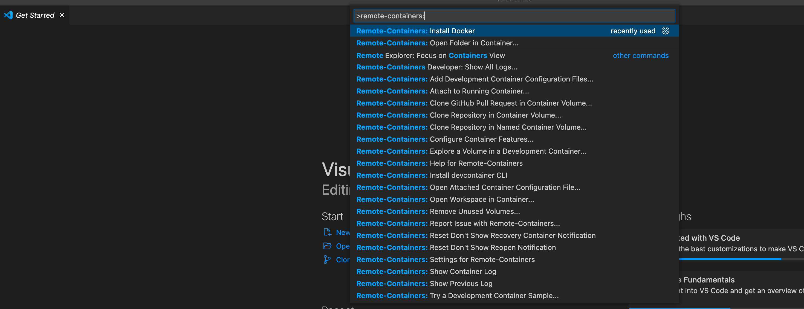

# Install docker container with vscode
`Remote container: Install docker`

# Add a container configuration file
Use Remote container config:

`Remote container: Add a development container configuration file`

Manual:

Step 1: Create devcontainer.json file:

`mkdir -p .devcontainer`

`cd .devcontainer`

`vim devcontainer.json`

Step 2: Create a docker configuration file:

`mkdir -p docker`

`cd docker`

`vim DockerFile`

# Docker command lines useful
Refer: https://docs.docker.com/engine/reference/commandline/docker/

## Pull an image or a repository from a registry
`docker pull NAME[:TAG|@DIGEST]`

## List images
`docker images`

## Remove image
`docker image rm [REPOSITORY:TAG]`

ex: `docker pull ros:noetic`

## List process
`docker ps -a`

## Stop/Kill process
`docker stop [CONTAINER_ID]`
`docker kill [CONTAINER_ID]`

## Remove container
`docker rm [CONTAINER_ID]`

## Remove a docker image process
`docker ps -a`                # Lists containers (and tells you which images they are spun from).

`docker images`               # Lists images.

`docker rm <container_id>`    # Removes a stopped container.

`docker rm -f <container_id>` # Forces the removal of a running container (uses SIGKILL).

`docker rmi <image_id>`       # Removes an image.
                              # Will fail if there is a running instance of that image i.e. container.

`docker rmi -f <image_id>`    # Forces removal of image even if it is referenced in multiple repositories,
                              # i.e. same image id given multiple names/tags.
                              # Will still fail if there is a docker container referencing image.

# Docker bash completion
To enable the bash completion in docker container app (meaning that, when you use the git co... -> tab -> git commit).

In Dockerfile, install the `bash-completion` package.

https://docs.docker.com/compose/completion/
